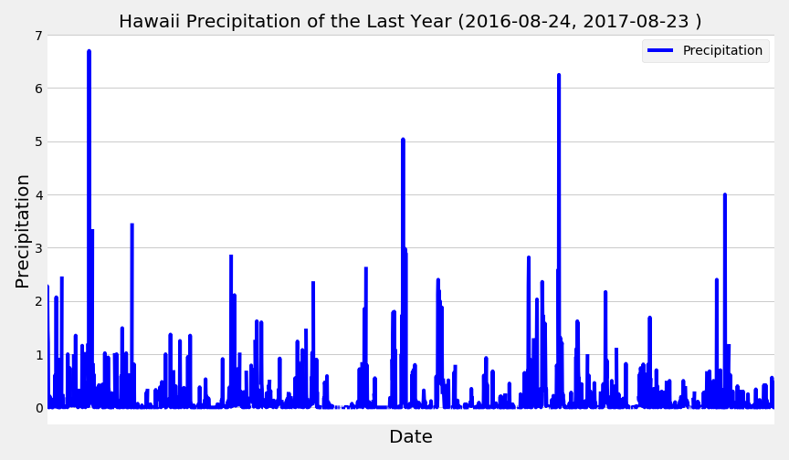
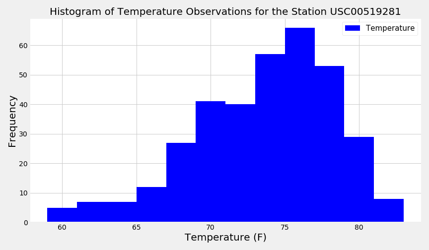
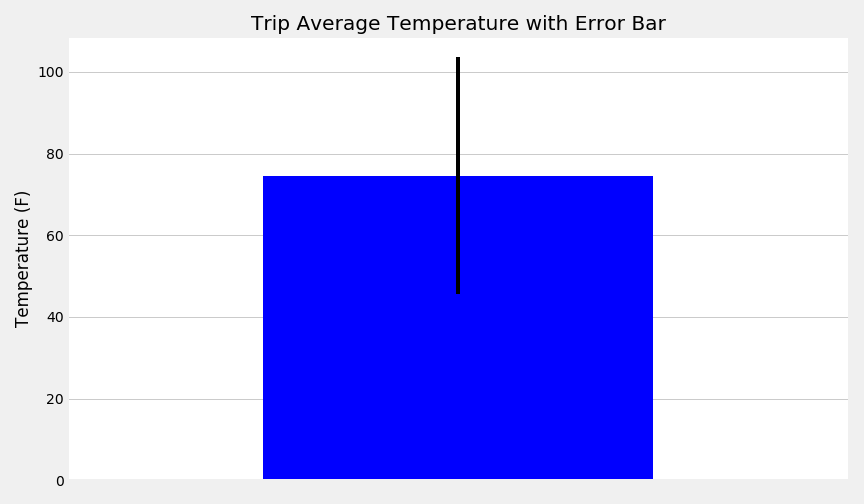
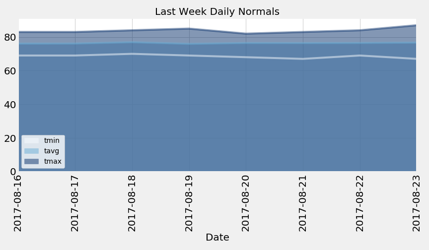
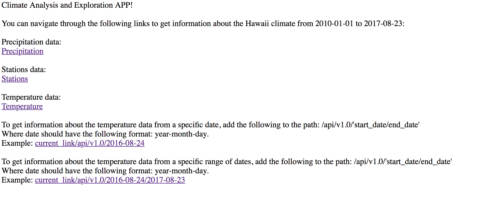

# Surfs Up!

## Step 1 - Climate Analysis and Exploration
A jupyter notebook is created to gather climatological data from Honolulu, Hawaii from a SQLite file to perform the following analysis:

Precipitation Analysis

Station Analysis

Temperature Analysis

Congratulations! You've decided to treat yourself to a long holiday vacation in Honolulu, Hawaii! To help with your trip planning, you need to do some climate analysis on the area. The following outlines what you need to do.

## Step 2 - Create a Climate App using the analysis made in the step 1

